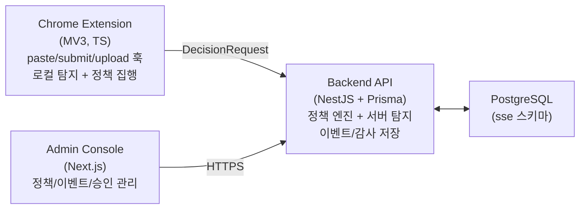
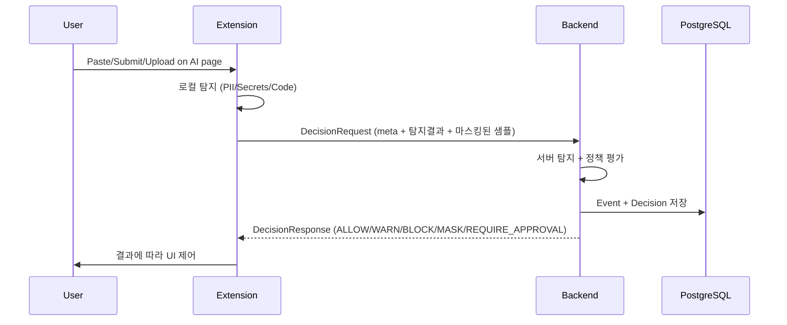

# AI-Aware SSE

AI 웹 서비스(ChatGPT, Claude, Gemini, Copilot)에 대한 텍스트 입력/붙여넣기/파일 업로드 시 민감정보 유출을 통제하는 보안 솔루션.

- 차단(BLOCK) / 마스킹(MASK) / 경고(WARN) / 승인 후 허용(REQUIRE_APPROVAL)을 정책으로 결정
- 모든 결정에 대해 감사 로그(누가/언제/무엇을/왜)를 남기고 조회 가능

---

## 아키텍처



| 구성요소 | 기술 스택 | 역할 |
|----------|-----------|------|
| **Extension** | Chrome MV3, TypeScript, esbuild | 이벤트 훅, 로컬 PII 탐지, 마스킹/차단 UI |
| **Backend** | NestJS, Prisma, PostgreSQL | 정책 평가, 서버 탐지, 이벤트/감사 저장 |
| **Admin Console** | Next.js, AG Grid | 대시보드, 이벤트 조회, 정책 편집, 승인 처리 |
| **DB** | PostgreSQL (`sse` 스키마) | 정책/이벤트/결정/승인 케이스 저장 |

---

## 탐지 정책 (Detection)

### PII 탐지 패턴 (12종)

Backend(`detector.service.ts`)와 Extension(`transform.ts`)에서 동일한 패턴을 사용한다.

| # | 패턴 | 정규식 | 문맥 조건 |
|---|------|--------|-----------|
| 1 | 주민등록번호 | `YYMMDD-[1-4]XXXXXX` | — |
| 2 | 휴대전화 | `01[016789]-XXXX-XXXX` | — |
| 3 | 일반전화 | `0XX-XXXX-XXXX` | 01x 제외 (휴대폰 중복 방지) |
| 4 | 이메일 | `xxx@xxx.xx` | — |
| 5 | 여권번호 | `[MSROD]XXXXXXXX` | "여권/passport" 키워드 필요 |
| 6 | 운전면허 | `XX-XX-XXXXXX-XX` | — |
| 7 | 사업자등록번호 | `XXX-XX-XXXXX` | — |
| 8 | 카드번호 | `XXXX-XXXX-XXXX-XXXX` | — |
| 9 | 계좌번호 | `숫자-숫자-숫자` | "계좌/은행/송금/입금/이체/출금" 키워드 필요 |
| 10 | 주소 | 시도 + 상세 / 동·호·층·번지 | — |
| 11 | 한글 이름 | 한글 2~4자 | **문맥 필수** (아래 참조) |
| 12 | 생년월일 | `YYYY-MM-DD` | Extension 마스킹용 |

### 한글 이름 탐지 — 문맥 필수 정책

성씨 단독 매칭은 일반 단어와 구분 불가 (예: "현실적"→현, "고객"→고, "인형"→인).
**반드시 다음 조건 중 하나를 충족해야 이름으로 판정:**

1. **앞에 레이블**: `이름:`, `성명:`, `담당자:`, `작성자:` 등
2. **뒤에 호칭**: `님`, `씨`, `과장`, `부장`, `팀장`, `선생`, `교수`, `박사` 등
3. **성씨 + 근처 PII**: 첫 글자가 한국 성씨(~100개) **이면서** ±100자 이내에 전화번호/이메일/주민번호 존재

```
이름: 홍길동          → ✅ (레이블)
홍길동님 안녕하세요    → ✅ (호칭)
홍길동 010-1234-5678  → ✅ (성씨 + 근처 PII)
현실적인 방안을 모색   → ❌ (문맥 없음 → 무시)
```

### Secrets 탐지

- Bearer 토큰, API key/secret 패턴
- OpenAI/Anthropic 키 (`sk-xxx`, `sk_proj-xxx`)
- AWS 키 (`AKIA...`)
- 32~64자 hex + "key" 키워드

### Code 탐지

- 코드 블록 (`` ``` ``), import/require/function/class 키워드
- export, const/let/var 선언, 화살표 함수, 주석
- 괄호 밸런스 휴리스틱

### Extension 마스킹 방식

| PII 유형 | 마스킹 결과 |
|----------|------------|
| 이름 | `홍**` (첫 글자만 노출) |
| 전화번호 | `010-****-5678` |
| 일반전화 | `02-****-5678` |
| 이메일 | `user@***.***` |
| 주민등록번호 | `900101-*******` |
| 운전면허 | `11-**-******-**` |
| 사업자등록번호 | `123-**-*****` |
| 카드번호 | `1234-****-****-3456` |
| 생년월일 | `1990-**-**` |

---

## 정책 결정 흐름



**컨텐츠 최소 수집 원칙**: 원문 저장/전송 X. 해시 + 길이 + 탐지결과 + 마스킹된 짧은 샘플만 전송.

---

## 배포

### CI/CD

`.github/workflows/deploy.yml` — main 브랜치 push 시 자동 배포 (SSH → 서버)

- **변경 감지**: backend/frontend/workflow 파일 변경 여부 자동 판별
- **서버**: PM2로 `sse-backend`, `sse-frontend` 프로세스 관리

### 로컬 개발

```bash
# DB
docker compose up -d

# Backend
cd backend && pnpm install && npx prisma generate && pnpm run start:dev

# Admin Console
cd frontend-admin && pnpm install && pnpm run dev

# Extension (개발)
cd extension && pnpm run build
# Extension (운영 모드 로컬 테스트)
cd extension && pnpm run build:prod
# → Chrome에서 extension/dist 폴더 로드
```

### DB 초기화

```bash
# Docker 최초 기동 시 initdb/ SQL 자동 실행
docker compose up -d

# 수동 적용 시
psql -f initdb/01_create_db_user.sql
psql -f initdb/02_schema.sql
psql -f initdb/03_seed.sql
```

> **주의**: 테이블은 `sse` 스키마에 있음. `public`이 아닌 `sse.policies`, `sse.tenants` 등을 조회해야 함.

---

## Repo 구조

```
ai-aware-sse/
  docker-compose.yml
  initdb/                   # DB 스키마 + 시드
  backend/                  # NestJS + Prisma
    src/
      extension/            # decision-requests, approval-cases API
      admin/                # dashboard, events, approvals, policies API
      policy/               # 정책 엔진
      detector/             # PII/Secrets/Code 서버 탐지
  frontend-admin/           # Next.js (Admin 콘솔)
  extension/                # Chrome MV3
    src/
      content.ts            # 이벤트 훅 + 탐지
      transform.ts          # PII 마스킹/익명화
      background.ts         # 서비스 워커
      api.ts                # Backend 통신
      modal.ts              # WARN/BLOCK/APPROVAL UI
    build.mjs               # esbuild 빌드 스크립트
  .github/workflows/
    deploy.yml              # 자동 배포
  docs/
    MVP_WORK_SPEC.md
```
