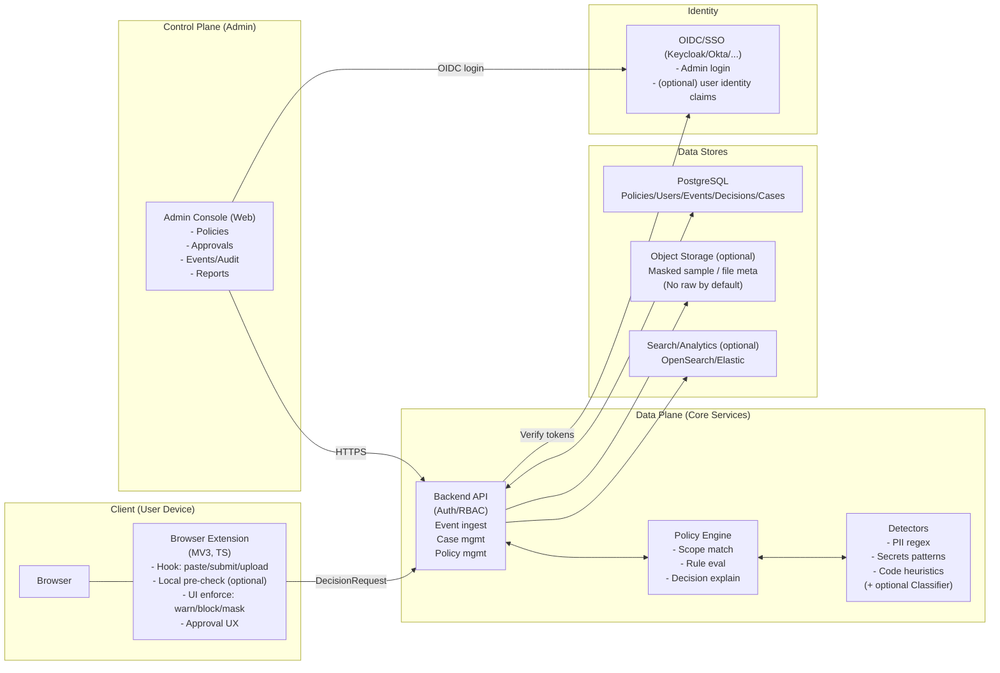
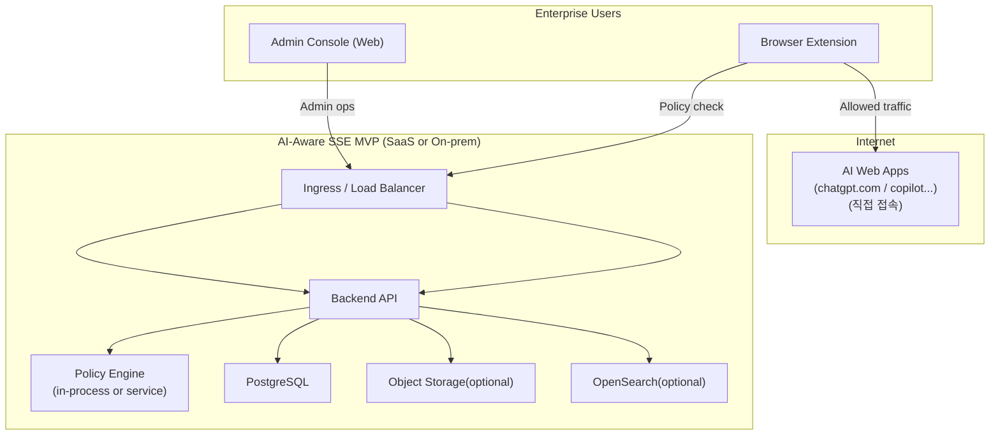
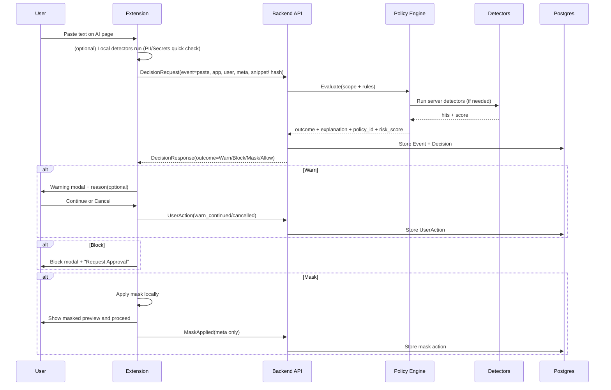
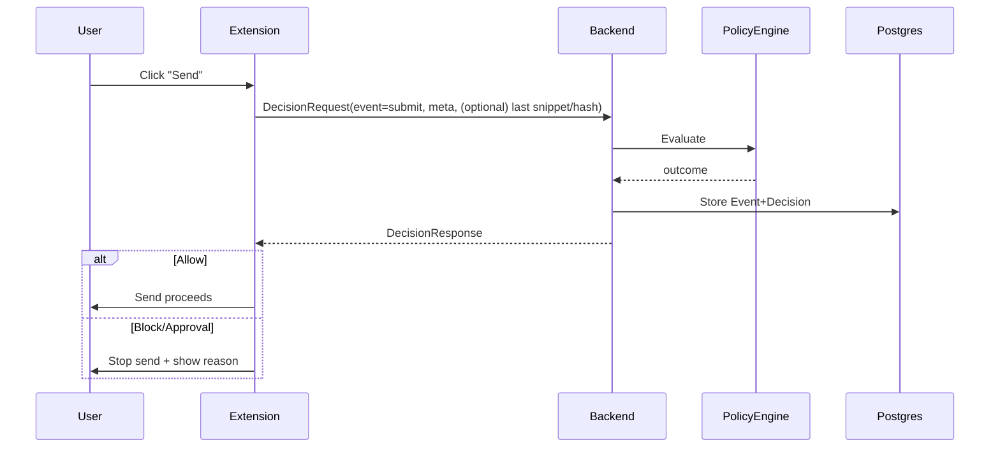
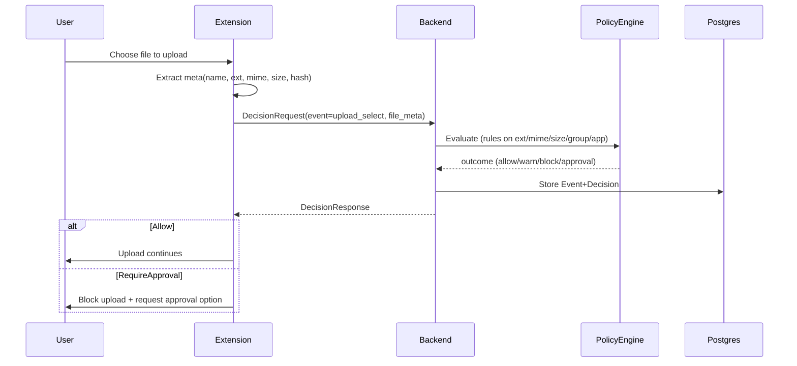
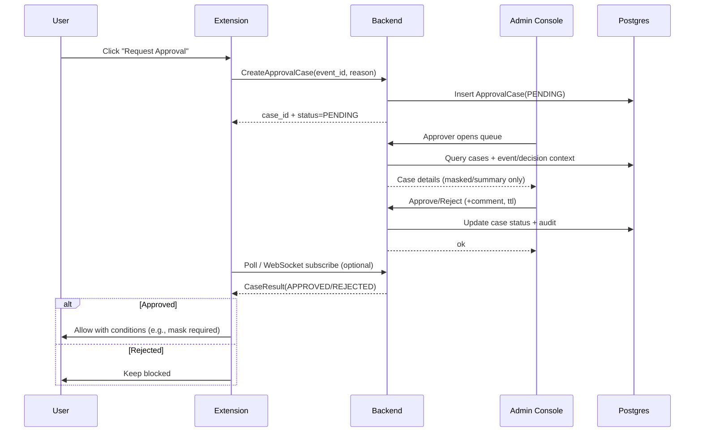

### 목표(성공 기준)
- AI 웹 서비스에 대한 텍스트 입력/붙여넣기/파일 업로드 흐름에서 민감정보 유출을 통제
- 차단/마스킹/경고/승인 후 허용을 정책으로 결정
- 모든 결정에 대해 감사 로그(누가/언제/무엇을/왜) 를 남기고 조회 가능
- PoC 고객 환경에서 2~4주 내 가치 증명(티켓 감소, 정책 준수 증빙, 유출 시도 탐지)

### 비목표(초기에는 안 함)
- 지원 범위 확대:
	더 많은 브라우저/네이티브/모바일 앱 등 지원
	다양한 AI 서비스/프로토콜 추가 지원
- 엔드포인트 DLP 기능 강화:
	스크린샷, 프린트, 클립보드, 임의 앱 전송 등 추가 제어
- CASB(Cloud Access Security Broker) 기능 확장:
	SaaS API 연동, 사후(레트로) 스캔, 자동 위반 탐지
- 정통 SASE 풀스택 확장:
	SD-WAN, FWaaS 등 네트워크 계층까지 보안 영역 확대
- 플랫폼 안정성/확장성 강화:
	멀티테넌트, 키/데이터 분리, 무결성/서명 등 엔터프라이즈 지원
- 더 정교한 탐지기 및 정책 관리:
	머신러닝 분류기/지능형 탐지, 조건부 정책, 버전 관리 등

## 진행 상황 (MVP → 제품 구조)

- **Backend (NestJS)**  
  - 제품형 부트스트랩: `src/main.ts`에 Swagger(OpenAPI), ValidationPipe, CORS(프론트 3000), Helmet/Compression, pino-http 로깅.  
  - **API 구현**: 전역 prefix `api/v1`.  
  - **Extension**: Bearer `EXT_DEVICE_TOKEN` Guard(A1). decision-requests 실구현, approval-cases/approval-cases/:id DB 연동(A2).  
  - **Admin**: dashboard/summary, events(목록·상세), approvals(목록·단건·decide), policies(목록·단건·수정·비활성화) Prisma 연동(A3).  
  - **Audit**: decision_created, policy_updated, policy_disabled, approval_decided(A4).  
- **Admin (Next.js)**  
  - Dashboard(기간 필터·메트릭·top_apps/top_detectors), Events 목록·상세, Policies 목록·편집, Approvals 대기·처리(승인/거절) 화면 구현(Phase B).  
- **DB**  
  - PostgreSQL 스키마/시드(`initdb/`), docker-compose 준비.  
- **Extension (Chrome MV3)**  
  - `extension/`: paste(submit/upload_select) 훅, decision 요청, WARN/BLOCK/REQUIRE_APPROVAL 모달, 승인 요청 → case 생성 → 폴링. chatgpt.com / claude.ai / copilot / gemini 도메인 매칭. `pnpm run build` → Chrome에서 `extension` 폴더 로드.  
- **작업 명세**  
  - [docs/MVP_WORK_SPEC.md](docs/MVP_WORK_SPEC.md): 출시 가능 MVP 작업 명세 (Phase A/B/C/D).  
- **PoC 배포**  
  - [docs/DEPLOYMENT_POC.md](docs/DEPLOYMENT_POC.md): 서버(공인 IP/도메인) 배포 및 확장 프로그램 사용자 배포 방법.  
- **이미 구현됨**  
  - 서버 측 Detector: `sample_masked` 기반 PII/Secrets/Code 규칙 탐지 후 `local_detectors`와 병합.  
  - 정책 캐시: tenant별 메모리 캐시(TTL 1분), 정책 수정 시 무효화.  
- **아직 미진행(선택)**  
  - Admin 로그인(OIDC), Extension 토큰 발급/관리 강화.  
  - 시나리오별 정책 동작 검증: `docs/TEST_SCENARIOS.md` 및 `docs/run-decision-scenarios.sh`로 테스트 가능.

## 1. MVP 범위: 구성요소와 책임
1.1 구성요소
1. Browser Extension (Chrome 우선)
	- AI 도메인별 “입력/붙여넣기/업로드” 이벤트 훅
	- 정책 평가 요청(메타데이터 + 컨텐츠 샘플/해시)
	- 정책 결과에 따라 UI/동작 제어(경고/차단/마스킹/승인 유도)
2. Policy Engine API
	- 정책(Condition → Action) 평가
	- 탐지기(Detectors) 실행: 규칙 기반 + (선택) 경량 분류
	- 결정 결과 + 근거(매칭 룰/탐지 결과/리스크 점수) 반환
3. Admin Console (Web)
	- 정책 관리(초기 템플릿 제공)
	- 이벤트/감사 조회, 케이스(승인 요청) 처리
	- 사용자/그룹 매핑(SSO 연동은 최소 OIDC 로그인부터)
4. Event Store + Audit Log
	- 이벤트(행위)와 결정(정책결과) 저장
	- 검색/필터/리포트(주간/월간)

1.2 배포 형태(권장)
- 초기 PoC: SaaS 형태(단, 고객 요구 시 단일 VM/컨테이너로 온프렘 가능)
- 확장은 나중: 멀티테넌트/키 분리/감사 무결성(서명)
## 2. 기능 목록 (MVP)
2.1 사용자(브라우저) 기능
1. 지원 도메인에서 아래 이벤트 감지
	- Prompt 입력(typing)
	- Paste(붙여넣기)
	- File Upload(업로드 선택/전송 시도)
2. 정책 결과에 따른 동작
	- Allow: 그대로 진행
	- Warn: 경고 모달 + 사용자 사유 입력(옵션) + 진행/취소
	- Block: 전송 차단 + 사유 안내 + “승인 요청” 버튼
	- Mask/Redact: 민감 부분 마스킹 후 전송(텍스트만 MVP에서)
	- Require Approval: 관리자 승인 전까지 전송 보류(텍스트/파일 공통)
3. 사용자 알림/설명
	- “어떤 데이터 유형 때문에” 막혔는지(너무 상세한 노출은 금지 옵션)
	- 정책 링크/가이드(조직 정책 문서 링크)

2.2 관리자(콘솔) 기능
1. 정책 CRUD (Create/Read/Update/Delete)
2. 정책 템플릿 제공(PII, 소스코드, 비밀키/토큰, 고객DB 덤프 등)
3. 승인 큐(Approval Queue)
	- 승인/거절/조건부 승인(예: 마스킹 후 허용)
	- 승인 코멘트/만료시간
4. 이벤트/감사 검색
	- 사용자/그룹/앱(도메인)/액션(차단/경고/마스킹)/탐지유형/시간
5. 리포트
	- Top 차단 원인, Top 사용자/부서, AI 앱별 이벤트 추이
	- “정책 위반 시도” 요약

2.3 플랫폼(관리/운영) 기능
1. 테넌트(고객) 분리(최소 논리 분리)
2. RBAC(관리자/승인자/감사자)
3. 데이터 보관기간(기본 30/90/180일 옵션)
4. 개인정보 최소수집 옵션
	- 컨텐츠 원문 저장 안 함(기본)
	- 해시/요약/마스킹된 샘플만 저장 옵션

## 3. 화면 설계(IA + 핵심 화면)
3.1 IA(Information Architecture)
- Dashboard
- Events
- Approvals
- Policies
- Detectors(탐지기 설정)
- Users & Groups
- Apps(지원 도메인/앱 설정)
- Settings(보관기간, 마스킹 룰, 알림, RBAC)

3.2 핵심 화면(요약)
1. Dashboard
	- 오늘/주간 이벤트 수, 차단률, 승인 대기
	- AI 앱별(도메인별) 트래픽/차단 상위
	- 탐지 유형별(PII/Code/Secrets) 상위
2. Events List
	- 표 컬럼: Time, User, Group, App, EventType(paste/upload), Decision, DetectorHits, RiskScore, CaseLink
	- 필터: time range, app, decision, detector type, group
3. Event Detail
	- 요청 메타데이터(사용자, 앱, URL path, 디바이스, 브라우저)
	- 정책 결정 경로(매칭된 정책/룰 우선순위)
	- 탐지 결과(어떤 detector가 어떤 이유로 hit)
	- (옵션) 샘플: “마스킹된 일부” 또는 “요약”
	- 후속 액션(케이스 생성, 정책 예외 제안)
4. Approvals Queue
	- 승인요청 리스트(요청자/앱/이벤트/요청 사유/탐지 유형/위험도)
	- 승인/거절/조건부 승인(마스킹 후 허용)
	- 만료(예: 2시간/1일)
5. Policy Editor
	- 기본 정보: 이름, 설명, 상태(enabled), 우선순위(priority), scope(앱/그룹)
	- 조건(Conditions) 빌더
	- 액션(Action) 선택 + 파라미터(마스킹 방식 등)
	- 시뮬레이션(Test): 샘플 텍스트 넣고 결과 확인
6. Detectors
	- PII 규칙(국가별 주민/전화/이메일/계좌 등)
	- Secrets 규칙(API key 패턴, 토큰)
	- Code heuristics(코드 블록/파일 확장자/키워드)
	- (선택) 분류기: “기밀문서/소스코드/계약서/고객데이터” 라벨링
7. Apps
	- 지원 도메인 목록(allowlist)
	- 앱별 설정(업로드만 통제/전체 통제, 세부 훅 옵션)


## 4. AI-Aware SSE MVP는 본질이 3개입니다.
1. 브라우저에서 이벤트를 정확히 훅킹(paste/submit/upload)
2. 정책 엔진이 일관되게 결정(Allow/Warn/Block/Mask/Approval)
3. 감사/케이스(승인) 흐름이 제품처럼 동작(증빙/검색/리포트)
→ 따라서 기술 선택은 “멋진 언어”보다 Extension 개발 생산성 + 백엔드 안정성 + 감사 저장/검색에 맞춰야 합니다.

Browser Extension (Chrome)
API Gateway / Backend API
Policy Engine (서비스로 분리하거나 모듈로 시작)
Detector Service(규칙기반) + (옵션) Classifier
Admin Console(Web)
Data: PostgreSQL + (옵션) OpenSearch/Elastic

Extension: TypeScript + Manifest V3
Backend: Node.js(또는 Bun) + TypeScript (NestJS/Fastify)
Admin: Next.js(React) + TypeScript
DB: PostgreSQL (Prisma/TypeORM)

## 5. 핵심 설계 선택 5가지(중요)
5.1 컨텐츠 저장 정책(보안제품의 생명)
- 기본: 원문 저장 안 함
- Detector는 “로컬(Extension)에서 1차” + “서버에서 2차(필요 시)”로 설계
- 저장은:  해시 + 길이 + 탐지 결과 + 마스킹된 아주 짧은 샘플(옵션) 

5.2 정책 엔진 구현 방식
- 정책은 DB에 JSON으로 저장하되,
- 서버에서는 “정규화된 AST”로 캐시(빠른 평가)
- 룰 우선순위, 스코프(앱/그룹/이벤트) 매칭을 먼저 하고 Detector 실행

5.3 멀티테넌트
- MVP는 “tenant_id 필드 + 논리 분리”로 충분
- 2단계에서 키 분리/암호화/서명 확장

5.4 인증/권한
- MVP: Admin Console 로그인만 OIDC
- Extension은:  사용자 세션에서 토큰을 안전하게 얻는 방식(SSO 연동 단계에서) 또는
		“디바이스 등록 토큰”으로 시작(PoC 단순화)

5.5 로그/이벤트 처리
- 이벤트가 늘면 큐(Kafka/Rabbit/SQS)가 필요하지만,
- MVP는 DB direct insert + 배치 집계로 시작해도 됨
- 단, 이벤트 스키마는 처음부터 “추후 큐”를 고려해 버전 필드 포함


## 6.컴포넌트 다이어그램(논리 아키텍처)




포인트(개발 관점)
Extension은 “집행(Enforcement)”의 주체: 차단/마스킹/경고 UI는 확장에서 처리
Backend는 “결정(Decision) + 감사(Audit) + 케이스(Approval)”의 주체
Policy Engine/Detectors는 처음엔 모듈(같은 서비스)로 시작해도 OK, 성능/팀 구조에 따라 서비스 분리

## 7.배포 구성도(MVP 운영 형태 예시)




## 8.데이터 흐름(시나리오별)
 Extension → Backend 요청 페이로드 최소화 원칙
	기본: content 원문 전송/저장 X
	전송하는 것: 이벤트 타입, 도메인, 길이, 해시, 탐지 결과(로컬 탐지 시), 일부 샘플(옵션, 마스킹된 짧은 길이)

3.1 시나리오 A: Paste(붙여넣기) → 정책 평가 → Warn/Block/Mask



핵심 구현 팁
“typing 중 매 keystroke 평가”는 비용이 큼 → Paste/Submit/Upload 트리거 중심
서버 탐지기는 “필요할 때만” 실행 (예: 로컬에서 이미 위험 낮으면 서버 생략)

3.2 시나리오 B: Submit(전송 버튼 클릭) 직전 최종 평가
Paste 이후 사용자가 편집했을 수 있으니 Submit에서 한 번 더 최종 평가가 안전합니다.


3.3 시나리오 C: File Upload → 메타 평가 → (필요 시) 승인
MVP에서는 “파일 내용 전체 업로드/스캔”을 피하고, 파일 메타 + 확장자/MIME + 크기 + (가능하면) 로컬 요약/해시 중심으로 시작합니다.


3.4 시나리오 D: 승인(Approval) 흐름
승인은 “유저가 요청 → 관리자 승인/거절 → 확장에 결과 전달”입니다.

MVP 권장: Extension은 폴링(polling) 으로 시작(5~15초 간격).
2단계에서 WebSocket/SSE로 개선.


## 9. 데이터가 실제로 어떻게 쌓이는지(DB 관점 요약)
핵심 엔티티 흐름
- Event(paste/submit/upload…) 생성
- Decision(policy match + detector hits + outcome) 생성
- 필요 시 ApprovalCase 생성(PENDING)
- 승인 처리 시 ApprovalCase 업데이트 + Audit trail 추가
- 대시보드/리포트는 Event/Decision 집계로 구성

## 9.1 Admin 콘솔에 데이터가 비어 있을 때 (Events/정책 없음)

Admin에서 **Events**, **Policies**가 비어 있다면 다음을 확인하세요.

1. **DB 스키마(sse) 사용**  
   - 테이블은 **`sse`** 스키마에 있습니다(`initdb/02_schema.sql`).  
   - Backend는 Prisma로 **sse** 스키마를 사용하도록 설정되어 있습니다.  
   - **DATABASE_URL**이 `sse_db`를 가리키고, Prisma `schema.prisma`에 `schemas = ["sse"]` 및 각 모델에 `@@schema("sse")`가 있어야 합니다.  
   - DB 도구에서 `public`이 아닌 **sse** 스키마(또는 `sse.policies`, `sse.tenants`)를 조회해야 같은 데이터를 보게 됩니다.

2. **테넌트 이름 'PoC Tenant'**  
   - 정책/목록 API는 **테넌트 이름이 `PoC Tenant`인 행**을 먼저 찾고, 그 `tenant_id`로만 정책을 조회합니다.  
   - `tenants` 테이블에 `name = 'PoC Tenant'`인 행이 없으면 목록이 항상 비어 있게 됩니다.  
   - 시드(`03_seed.sql`)를 적용하면 해당 테넌트와 정책 4종이 생성됩니다.

3. **정책/테넌트 데이터**  
   - Policies 목록과 대시보드 집계는 **PostgreSQL**에 저장된 데이터를 사용합니다.  
   - **초기 데이터**(PoC Tenant, 앱, 그룹, 정책 4종 등)를 넣으려면 **initdb 시드**를 적용해야 합니다.

4. **시드 적용 방법**  
   - **Docker 사용 시**: `docker-compose up`으로 PostgreSQL을 **최초 기동**하면 `initdb/` 아래 SQL(01 → 02 → 03)이 자동 실행됩니다.  
     이후 Admin을 새로고침하면 Policies에 시드 정책이 보입니다.  
   - **로컬 DB 사용 시**: DB 생성 후 `initdb/01_create_db_user.sql`, `02_schema.sql`, `03_seed.sql` 순서로 실행하세요.  
     (Backend `.env`의 `DATABASE_URL`이 해당 DB를 가리키는지 확인)

5. **Events가 비어 있는 경우**  
   - Events는 **Extension**이 붙여넣기/전송/업로드 시 Backend에 요청할 때마다 쌓입니다.  
   - Extension을 설치·설정한 뒤, 지원 도메인(예: chatgpt.com)에서 실제로 붙여넣기나 전송을 해보면 Events에 기록됩니다.

6. **정책 관리(추가/비활성화)**  
   - **정책 추가**: Admin → Policies → "정책 추가" 버튼으로 새 정책을 만들 수 있습니다.  
   - **비활성화(홀딩)**: Policies 목록에서 정책 선택 → 편집 → "비활성화"로 사용 중단(삭제는 없음, 비활성화만 지원).

## 10. MVP에서 놓치면 큰일나는 3가지(구성/데이터 흐름 관점)
- 원문 저장/전송 최소화(디폴트): 나중에 법/보안 이슈로 개발 중단될 수 있음
- Decision Explainability: “왜 차단/허용”을 이벤트로 남겨야 운영이 됨
- 정책/탐지 버전 관리: 같은 이벤트라도 “당시 정책 버전”을 남겨야 감사/재현 가능

## 11. OpenAPI 3.0 YAML로 생성, DB 도커로 생성
mkdir -p initdb pgdata
./initdb/01_create_db_user.sql
./initdb/02_schema.sql
./initdb/03_seed.sql
docker compose up -d

docker exec -it ai_aware_sse_postgres psql -U postgres -d sse_db -c "ALTER ROLE sse_app WITH PASSWORD 'smart1234';"
docker exec -it ai_aware_sse_postgres psql -U postgres -d sse_db -c "ALTER ROLE postgres WITH PASSWORD 'smart1234';"

## 12. Repo 구조(모노레포)

```
ai-aware-sse/
  docker-compose.yml
  initdb/
    01_create_db_user.sql
    02_schema.sql
    03_seed.sql
  backend/                  # NestJS, Prisma
    src/
      main.ts
      extension/            # decision-requests, approval-cases
      admin/                # dashboard, events, approvals, policies
      policy/               # policy-engine
      prisma/
    prisma/
      schema.prisma
    openapi/
      OpenAPI.yaml
  frontend-admin/           # Next.js (Admin 콘솔)
    src/
    .env.local
  extension/                # Chrome MV3 (TypeScript)
    src/
      content.ts
      site-config.ts
      api.ts
      modal.ts
    manifest.json
  docs/
    MVP_WORK_SPEC.md
    DOM_VERIFICATION.md
    TODO_사이트별_DOM_및_이벤트_검증.md
  README.md
```

---

## 13. 다음 단계 안내

현재 **이벤트 탐지(Paste/Submit/Upload)와 DB 저장**이 동작하는 상태를 기준으로, 권장 진행 순서는 아래와 같습니다.

| 순서 | 단계 | 할 일 | 참고 |
|------|------|--------|------|
| **1** | **사이트별 검증** | 각 사이트( ChatGPT / Claude / Gemini )에서 페이지 로드 시 DOM 검증이 **1회 자동 실행**됨. 콘솔의 `[AI-Aware SSE] DOM 검증 결과` 로그로 composer·sendButton·첨부 상태 확인. 문제 있으면 해당 로그를 복사해 검증 요청하거나 `site-config.ts` 선택자 보정. PASTE·SUBMIT·UPLOAD_SELECT가 Admin Events에 정상 기록되는지 확인. | [docs/MVP_WORK_SPEC.md](docs/MVP_WORK_SPEC.md) |
| **2** | **정책·결정 품질** | (선택) 서버 측 Detector(D1): 요청 본문/메타로 PII·Secrets·Code 규칙 실행해 정책 결정에 반영. (선택) 정책 캐시(D2): tenant별 enabled 정책 메모리 캐시. | [docs/MVP_WORK_SPEC.md](docs/MVP_WORK_SPEC.md) Phase D |
| **3** | **사용자·관리자 경험** | Extension: WARN 모달·BLOCK 시 "승인 요청"·승인 후 재전송이 자연스럽게 동작하는지 시나리오 테스트. Admin: Events/Approvals/Policies 화면이 실제 운영에 맞는지 점검. | - |
| **4** | **운영·확장** | Extension 인증(device token 발급/관리), Admin 로그인(OIDC), 보관기간·RBAC·리포트 등. | README §5.4, §2.3 |

**한 줄 요약**: 1번(사이트별 DOM·이벤트 검증) 마무리 → 2번(서버 Detector·정책 캐시)로 정책 품질 보강 → 3·4번으로 UX·운영 강화.


