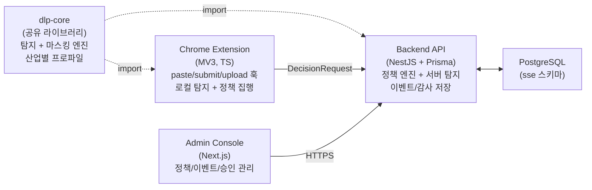
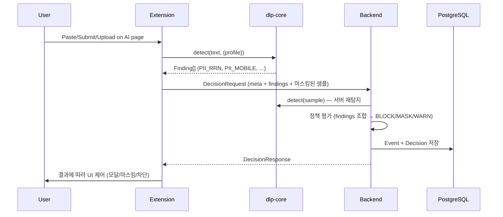

# AI-Aware SSE

AI 웹 서비스(ChatGPT, Claude, Gemini, Copilot)에 대한 텍스트 입력/붙여넣기/파일 업로드 시 민감정보 유출을 통제하는 보안 솔루션.

- **탐지(Detection)**: PII 12종 + Secrets 5종 + Code — 산업별 프로파일 지원
- **정책(Policy)**: 탐지 결과의 조합에 따라 BLOCK / MASK / WARN / REQUIRE_APPROVAL 결정
- **감사(Audit)**: 모든 결정에 대해 감사 로그(누가/언제/무엇을/왜)

---

## 아키텍처



| 구성요소 | 기술 스택 | 역할 |
|----------|-----------|------|
| **dlp-core** | TypeScript (pnpm workspace) | PII/Secrets/Code 탐지, 마스킹, 산업별 프로파일 |
| **Extension** | Chrome MV3, esbuild | 이벤트 훅, 로컬 탐지, 마스킹/차단 UI |
| **Backend** | NestJS, Prisma, PostgreSQL | 정책 평가, 서버 재탐지, 이벤트/감사 저장 |
| **Admin Console** | Next.js, AG Grid | 대시보드, 이벤트 조회, 정책 편집, 승인 처리 |

---

## 핵심 설계: 탐지 ≠ 정책

```
┌─────────────┐       ┌──────────────┐       ┌──────────────┐
│  Detection   │──────>│   Findings   │──────>│   Policy     │
│  (dlp-core)  │       │ PII_RRN: 1   │       │   Engine     │
│              │       │ PII_MOBILE: 2│       │              │
│ 모든 패턴을  │       │ PII_NAME: 1  │       │ 조합에 따라  │
│ 항상 탐지    │       │ SECRET: 0    │       │ BLOCK/MASK/  │
│              │       │ CODE: 0      │       │ WARN 결정    │
└─────────────┘       └──────────────┘       └──────────────┘
```

- **탐지**는 프로파일에 따라 모든 민감 항목을 찾는다
- **정책**이 탐지 결과의 조합에 따라 어떤 조치를 취할지 결정한다
- 같은 탐지 결과라도 그룹/산업에 따라 다른 정책이 적용될 수 있다

### 정책 조건 예시

```json
// 주민등록번호 1건이라도 → BLOCK
{ "detector": "PII_RRN", "op": "count_gte", "value": 1 }

// PII 전체 3건 이상 → BLOCK
{ "detector": "PII", "op": "count_gte", "value": 3 }

// 금융그룹: 카드 OR 계좌 → BLOCK
{ "any": [
  { "detector": "PII_CARD", "op": "count_gte", "value": 1 },
  { "detector": "PII_ACCOUNT", "op": "count_gte", "value": 1 }
]}
```

---

## 탐지 엔진 (dlp-core)

### PII 탐지 패턴 (12종)

`packages/dlp-core` — Backend와 Extension이 **동일한 소스**를 import하여 drift 방지.

| # | 유형 | FindingType | 정규식 | 문맥 조건 | 마스킹 결과 |
|---|------|-------------|--------|-----------|------------|
| 1 | 주민등록번호 | `PII_RRN` | `YYMMDD-[1-4]XXXXXX` | — | `900101-*******` |
| 2 | 휴대전화 | `PII_MOBILE` | `01[016789]-XXXX-XXXX` | — | `010-****-5678` |
| 3 | 일반전화 | `PII_PHONE` | `0XX-XXXX-XXXX` | 01x 제외 | `02-****-5678` |
| 4 | 이메일 | `PII_EMAIL` | `xxx@xxx.xx` | — | `user@***.***` |
| 5 | 여권번호 | `PII_PASSPORT` | `[MSROD]XXXXXXXX` | "여권/passport" 키워드 | `M********` |
| 6 | 운전면허 | `PII_DRIVER` | `XX-XX-XXXXXX-XX` | — | `11-**-******-**` |
| 7 | 사업자등록번호 | `PII_BIZNO` | `XXX-XX-XXXXX` | — | `123-**-*****` |
| 8 | 카드번호 | `PII_CARD` | `XXXX-XXXX-XXXX-XXXX` | Luhn 검증 | `1234-****-****-3456` |
| 9 | 계좌번호 | `PII_ACCOUNT` | `숫자-숫자-숫자` | 계좌/은행/송금 키워드 | `110-***-******` |
| 10 | 주소 | `PII_ADDRESS` | 시도 + 상세 | — | `서울특별시 ***` |
| 11 | 한글 이름 | `PII_NAME` | 한글 2~4자 | **문맥 필수** | `홍**` |
| 12 | 생년월일 | `PII_DOB` | `YYYY-MM-DD` | — | `1990-**-**` |

### 한글 이름 탐지 — 문맥 필수 정책

**반드시 다음 조건 중 하나를 충족해야 이름으로 판정:**

1. **앞에 레이블**: `이름:`, `성명:`, `담당자:`, `고객명:` 등
2. **뒤에 호칭**: `님`, `씨`, `과장`, `부장`, `대표`, `판사` 등
3. **성씨 + 근처 PII**: 첫 글자가 한국 성씨(~100개) + ±100자 내 전화/이메일/주민번호

```
이름: 홍길동          → ✅ (레이블)
홍길동님 안녕하세요    → ✅ (호칭)
홍길동 010-1234-5678  → ✅ (성씨 + 근처 PII)
현실적인 방안을 모색   → ❌ (문맥 없음 → 무시)
```

### Secrets 탐지 (5종)

| FindingType | 대상 | 예시 |
|-------------|------|------|
| `SECRET_BEARER` | Bearer 토큰 | `Bearer eyJhbG...` |
| `SECRET_API_KEY` | API key/secret 패턴 | `api_key: sk-xxx` |
| `SECRET_OPENAI` | OpenAI/Anthropic 키 | `sk-proj-abc123...` |
| `SECRET_AWS` | AWS 액세스 키 | `AKIA1234567890ABCDEF` |
| `SECRET_HEX_KEY` | 32~64자 hex + "key" | `key=a1b2c3d4...` |

### Code 탐지

코드 블록, import/require/function/class, 화살표 함수, 주석, 괄호 밸런스 등 7가지 신호 점수.

---

## 산업별 탐지 프로파일

그룹/조직에 따라 어떤 PII를 탐지할지 설정. 프로파일은 탐지 범위만 결정하고, 정책이 조치를 결정.

| 프로파일 | 대상 | 활성 탐지 항목 | 특징 |
|----------|------|---------------|------|
| `DEFAULT` | 일반 기업 | 전체 12종 PII + Secrets + Code | 표준 설정 |
| `FINANCIAL` | 금융권 | 전체 + 카드/계좌 강화 | 금융 데이터 민감 |
| `GOVERNMENT` | 정부기관 | 전체 + 주민번호/주소/여권 강화 | 신원정보 민감 |
| `NIS` | 국정원 지침 | 전체 (가장 엄격) | 최고 보안 등급 |
| `HEALTHCARE` | 의료기관 | 전체 + 환자 정보 강화 | 의료법 준수 |
| `DEV_ONLY` | 개발팀 전용 | 주민번호/카드 + Secrets/Code | PII 최소, 코드 집중 |

---

## 정책 결정 흐름



**컨텐츠 최소 수집 원칙**: 원문 저장/전송 X. 해시 + 길이 + 탐지결과 + 마스킹된 짧은 샘플만 전송.

---

## 시드 정책 (기본 설정)

| 우선순위 | 정책 | 조건 | 조치 | 대상 그룹 |
|---------|------|------|------|----------|
| 10 | Block Secrets | Secrets 1건+ | BLOCK | 전체 |
| 15 | Block RRN | 주민번호 1건+ | BLOCK | 전체 |
| 18 | Finance Block Card/Account | 카드/계좌 1건+ | BLOCK | Finance |
| 20 | Block High PII | PII 3건+ | BLOCK | 전체 |
| 30 | Finance CSV/XLSX | 스프레드시트 업로드 | REQUIRE_APPROVAL | Finance |
| 45 | Dev Code File Upload | 소스코드 파일 첨부 | WARN | Dev |
| 50 | Dev Large Code Paste | 1500자+ 코드 | WARN | Dev |
| 54 | PII Anonymize | PII 1건+ | ANONYMIZE | 전체 (비활성) |
| 55 | PII Mask | PII 1건+ | MASK | 전체 (비활성) |

---

## 배포

### CI/CD

`.github/workflows/deploy.yml` — main 브랜치 push 시 자동 배포 (SSH → 서버)

- **변경 감지**: backend/frontend/packages/workflow 파일 변경 자동 판별
- **packages/** 변경 시 backend + frontend 모두 재배포
- **빌드 순서**: `dlp-core build` → `backend build` / `frontend build`

### 로컬 개발

```bash
# DB
docker compose up -d

# 공유 라이브러리 빌드 (최초 1회 + 변경 시)
cd packages/dlp-core && pnpm install && pnpm run build

# Backend
cd backend && pnpm install && npx prisma generate && pnpm run start:dev

# Admin Console
cd frontend-admin && pnpm install && pnpm run dev

# Extension
cd extension && pnpm run build      # 개발 모드
cd extension && pnpm run build:prod  # 운영 모드
# → Chrome에서 extension/dist 폴더 로드
```

### DB 초기화

```bash
docker compose up -d
# initdb/ SQL 자동 실행 (01_create_db_user → 02_schema → 03_seed)
```

> **주의**: 테이블은 `sse` 스키마에 있음.

---

## Repo 구조

```
ai-aware-sse/
  pnpm-workspace.yaml           # pnpm 워크스페이스 설정
  package.json                   # 루트 (빌드 스크립트)
  docker-compose.yml
  initdb/                        # DB 스키마 + 시드
  packages/
    dlp-core/                    # 공유 탐지/마스킹 라이브러리
      src/
        types.ts                 # FindingType, Confidence, Finding 등
        normalize.ts             # 텍스트 정규화 (zero-width 제거)
        patterns.ts              # PII 12종 + Secrets 5종 정규식
        detect.ts                # 탐지 파이프라인
        mask.ts                  # 마스킹/익명화 엔진
        profiles.ts              # 산업별 프로파일 (DEFAULT/FINANCIAL/...)
        index.ts                 # Public API
  backend/                       # NestJS + Prisma
    src/
      extension/                 # decision-requests, approval-cases API
      admin/                     # dashboard, events, approvals, policies API
      policy/                    # 정책 엔진 (scope match → condition eval)
      detector/                  # dlp-core 래핑 서비스
  frontend-admin/                # Next.js (Admin 콘솔)
  extension/                     # Chrome MV3
    src/
      content.ts                 # 이벤트 훅 + 탐지
      transform.ts               # dlp-core 마스킹 래퍼
      api.ts                     # Backend 통신
      modal.ts                   # WARN/BLOCK/APPROVAL UI
    build.mjs                    # esbuild 빌드 스크립트
  .github/workflows/
    deploy.yml                   # 자동 배포
```
